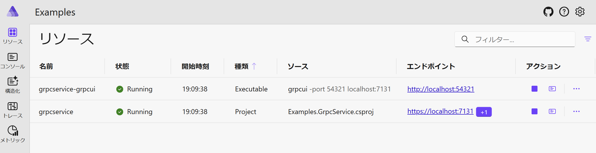

# AspireExtensions

- gRPC UI support for .NET Aspire.
  - AspireExtensions.GrpcUI
- gRPC UI support for .NET Aspire.
  - AspireExtensions.Hosting.Minio

## Table of Contents

- [AspireExtensions.GrpcUI](#aspireextensionsgrpcui)
  - [Install](#install)
  - [API](#api)
  - [Usage](#usage)
- [AspireExtensions.Hosting.Minio](#aspireextensionshostingminio)
  - [Install](#install-1)
  - [API](#api-1)
- [AspireExtensions.Minio.Client](#aspireextensionsminioclient)
  - [Install](#install-2)
  - [API](#api-2)

## AspireExtensions.GrpcUI

### Install

Install [grpcui](https://github.com/fullstorydev/grpcui) on your local machine.

- Windows
  - Download from [grpcui/releases](https://github.com/fullstorydev/grpcui/releases)
  - **Add PATH to `grpcui.exe`**
- Mac
  - `brew install grpcui`

Please check if grpcui is available by using the following command.

```
$ grpcui -version
```

And add package to your Aspire AppHost project.

```
$ dotnet add package AspireExtensions.GrpcUI
```

### API

`AspireExtensions.GrpcUI` provide `WithGrpcUI()` method.
Use `WithGrpcUI()` in your Aspire AppHost project.

```cs
using Aspire.Hosting;

var builder = DistributedApplication.CreateBuilder(args);

builder.AddProject<Projects.MyGrpcService>("grpcservice")
    .WithGrpcUI(port: 54321); // <- Add this!

builder.Build().Run();
```

### Usage

gRPC Reflection must be enabled to use the gRPC UI.

First, add `Grpc.AspNetCore.Server.Reflection` to your gRPC service project.

```
$ dotnet add package Grpc.AspNetCore.Server.Reflection
```

Then use `AddGrpcReflection()` and `MapGrpcReflectionService()`.

```cs
var builder = WebApplication.CreateBuilder(args);

// Add services to the container.

builder.Services.AddGrpc();

if (builder.Environment.IsDevelopment())
{
    builder.Services.AddGrpcReflection(); // <- Add this!
}

var app = builder.Build();

// Configure the HTTP request pipeline.

if (app.Environment.IsDevelopment())
{
    app.MapGrpcReflectionService(); // <- Add this!
}

app.MapGrpcService<GreeterService>();

app.Run();
```

Next, use `WithGrpcUI()` in your Aspire AppHost project.

```cs
using Aspire.Hosting;

var builder = DistributedApplication.CreateBuilder(args);

builder.AddProject<Projects.MyGrpcService>("grpcservice")
    .WithGrpcUI(port: 54321); // <- Add this!

builder.Build().Run();
```

Launch Aspire! You will see that grpcui is running.



By clicking endpoint on the Aspire dashboard, you can easily access the gRPC UI!


## AspireExtensions.Hosting.Minio

### Install

```
$ dotnet add package AspireExtensions.Hosting.Minio
```

### API

`AspireExtensions.Hosting.Minio` provide `AddMinio()` and `AddBucket` method.

```cs
var builder = DistributedApplication.CreateBuilder(args);

var minio = builder.AddMinio(
        name: "minio",
        userName: builder.AddParameter("MinioUser"),
        password: builder.AddParameter("MinioPassword")
    )
    .WithImageTag("RELEASE.2025-07-23T15-54-02Z")
    .WithDataVolume("my.minio.volume");

var bucketCreation = minio.AddBucket(["MyBucket1", "MyBucket2"])
    .WithImageTag("RELEASE.2025-07-21T05-28-08Z");

var webapi = builder.AddProject<Projects.MyWebApi>("webapi")
    .WithReference(minio)
    .WaitFor(minio)
    .WaitForCompletion(bucketCreation);
```

## AspireExtensions.Minio.Client

### Install

```
$ dotnet add package AspireExtensions.Minio.Client
```

### API

`AspireExtensions.Minio.Client` provide `AddMinioClient()`.

```cs
var builder = WebApplication.CreateBuilder(args);

builder.AddMinioClient("minio");
```
